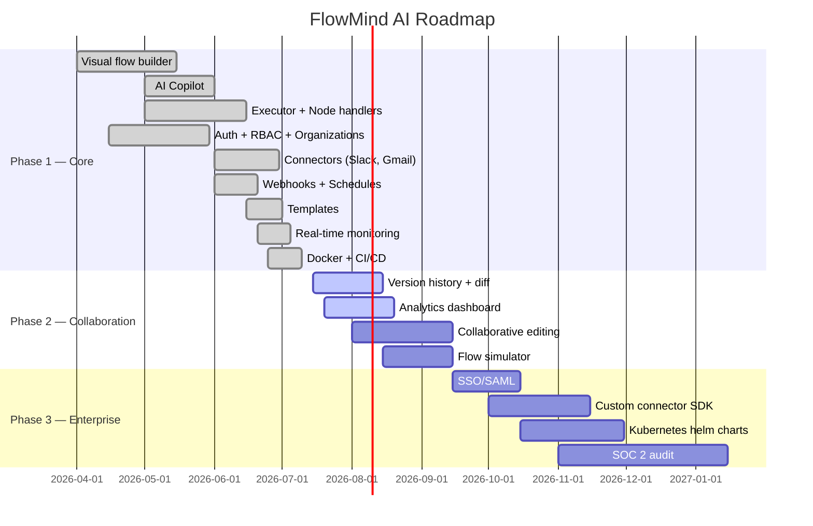

# FlowMind AI — Product Strategy

---

## Vision

**Democratize intelligent automation.**  
Make AI-powered workflow automation as easy as having a conversation. Every professional, regardless of technical skill, should be able to build, run, and monitor sophisticated automations using natural language.

---

## Mission

FlowMind AI exists to eliminate repetitive digital work by combining:
- **Visual workflow automation** (like Zapier/Make/n8n)
- **AI-native orchestration** (like Langflow)
- **Enterprise-grade security** (RBAC, encryption, audit logs)

All in one platform that any team can self-host or use as SaaS.

---

## Value Proposition

| For | Value |
|---|---|
| **Business Users** | Build automations by describing what you want in plain English. No coding required. |
| **Developers** | Full control with visual canvas + API keys + version control. Extend with custom connectors. |
| **Organizations** | Multi-tenant workspaces, RBAC, audit logs, encrypted secrets. SOC 2 ready. |
| **Everyone** | Lower cost than Zapier, more powerful than Make, easier than n8n, production-ready vs Langflow. |

---

## Personas

### 1. Admin Org (Alex)

**Role**: CTO / Head of Operations / IT Director  
**Goals**:
- Manage team access and permissions
- Control costs and monitor usage
- Ensure security compliance
- Integrate with existing enterprise tools

**Needs**: RBAC, audit logs, API key management, usage analytics, SSO (future)

### 2. Developer (Dana)

**Role**: Software Engineer / DevOps / Data Engineer  
**Goals**:
- Automate infrastructure and data pipelines
- Use API keys for programmatic access
- Version control flows as code
- Build custom connectors

**Needs**: tRPC/API access, flow export/import, webhook debugging, template creation

### 3. Business User (Bianca)

**Role**: Marketing / Sales / Operations / HR  
**Goals**:
- Automate repetitive tasks without IT help
- Get notified of important events
- Process data without spreadsheets
- Use pre-built templates

**Needs**: AI Copilot (natural language), templates, simple dashboard, Slack/Gmail connectors

### 4. Viewer (Victor)

**Role**: Manager / Stakeholder / Client  
**Goals**:
- See automation results and reports
- Monitor execution success rates
- View dashboards without editing

**Needs**: Read-only access, execution statistics, activity feed

---

## MVP Features (v0.1)

### Phase 1: Core Automation (Current)

- [x] Visual flow builder canvas with 8 node types
- [x] AI Copilot — generate flows from natural language
- [x] Flow execution engine with retry and timeout
- [x] Schedule-based triggers (cron)
- [x] Webhook triggers with HMAC verification
- [x] Multi-tenant organizations and workspaces
- [x] RBAC with 4 roles
- [x] JWT authentication with refresh token rotation
- [x] Variables with AES-256-GCM encryption
- [x] Slack and Gmail connectors
- [x] Real-time execution monitoring via Socket.io
- [x] Execution logs with step-by-step details
- [x] Notifications (in-app)
- [x] Templates and template marketplace
- [x] Scoped API keys (read/write/admin)
- [x] Rate limiting with Redis sliding window
- [x] Structured logging (Pino) + error tracking (Sentry)
- [x] Docker Compose deployment

### Phase 2: Collaboration & Insights (v0.2–0.3)

- [ ] Flow version history and diff
- [ ] Collaborative editing (multi-user canvas)
- [ ] Execution analytics dashboard (success rates, latency trends)
- [ ] Custom email templates for notifications
- [ ] Webhook retry management UI
- [ ] Flow testing/simulation mode
- [ ] Team comments on flows
- [ ] Slack/Discord notification channels
- [ ] Export flows as JSON/YAML

### Phase 3: Enterprise & Scale (v1.0+)

- [ ] SSO / SAML / OIDC authentication
- [ ] Audit log viewer UI with export
- [ ] Custom connector SDK / plugin system
- [ ] Scheduled reports (PDF/CSV exports)
- [ ] Prometheus metrics endpoint
- [ ] Horizontal scaling (read replicas, Redis cluster)
- [ ] On-premise Kubernetes deployment
- [ ] SOC 2 Type II compliance
- [ ] FlowMind CLI tool

---

## Roadmap

---

## Differentiation

| Feature | FlowMind AI | Zapier | Make | n8n | Langflow |
|---|---|---|---|---|---|
| **AI Copilot** (natural language → flow) | ✅ Native | ❌ | ❌ | ❌ | ✅ Experimental |
| **Self-hosted** | ✅ Docker/K8s | ❌ | ❌ | ✅ | ✅ |
| **Multi-tenant** | ✅ Built-in | ✅ | ✅ | ❌ | ❌ |
| **RBAC** | ✅ 4 roles | ✅ Limited | ✅ Basic | ❌ | ❌ |
| **Encrypted secrets** | ✅ AES-256-GCM | ✅ Varies | ✅ Varies | ❌ | ❌ |
| **Connectors** | 3 (extensible) | 5000+ | 1000+ | 200+ | ~10 |
| **Pricing** | Self-host = $0 | $20–$200/mo | $10–$170/mo | Free | Free |
| **AI providers** | OpenAI + Anthropic | OpenAI | OpenAI | Any API | Any API |
| **Real-time monitoring** | ✅ Socket.io | ✅ | ✅ | ❌ | ❌ |
| **Templates** | ✅ Built-in | ✅ | ✅ | ✅ Community | ❌ |
| **API Keys** | ✅ Scoped | ✅ | ✅ | ❌ | ❌ |
| **Webhook security** | ✅ HMAC + replay | ✅ HMAC | ✅ HMAC | ❌ | ❌ |
| **Type safety** | ✅ Full (tRPC + Zod) | ❌ | ❌ | ❌ | ❌ |

### Key Advantages

1. **AI Copilot is not an add-on — it's the core UX.** Unlike Zapier/Make where AI is bolted on as a chatbot, FlowMind's Copilot directly generates visual flows on the canvas. The user sees the result immediately and can tweak it.

2. **Enterprise security out of the box.** Self-hosted with RBAC, AES-256-GCM encryption, HMAC webhook verification, rate limiting, and audit logs. Competitors like n8n lack multi-tenancy and encryption.

3. **Developer-friendly.** tRPC with full type safety, scoped API keys, versioned flows, export/import — all things n8n and Zapier lack.

4. **Cost-effective.** Self-hosted at $0 infrastructure cost versus $20–$200/month/seat for Zapier/Make.

5. **Two AI providers with automatic fallback.** OpenAI is primary, Anthropic Claude is automatic fallback. No single point of failure.

### Key Gaps vs Competitors

- **Connector ecosystem** — Zapier has 5000+ connectors. We have 3. Strategy: focus on quality over quantity, build an SDK for community connectors.
- **Brand recognition** — Zapier is synonymous with automation. Strategy: target "Zapier power users who want AI + self-hosting."
- **Template library** — Zapier/Make have years of community templates. Strategy: AI can generate flows on demand, reducing dependency on pre-built templates.
